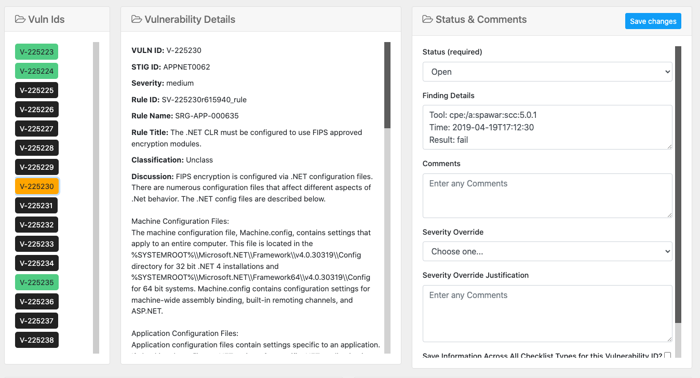
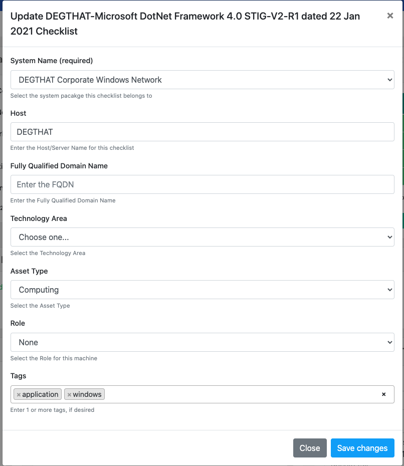
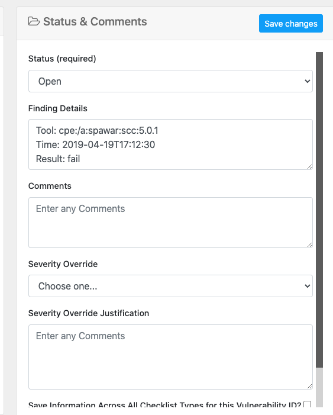

# Checklist Detailed View

The detailed Checklist page shows several things about the checklist. It shows the title, automatically named by the checklist uploaded. The format is "hostname"-"type of checklist"-"release and date of the checklist format". So a Windows 10 STIG from the Release 19 Oct 25 2019 of the STIG of the machine named "myserver" would be "MYSERVER-WIN 10 STIG-R19 dated 25 Oct 2019". 

The scoring of the checklist based on status is one of the first things you see as well. The total and then breakdown by category is shown with the relevant colors. There are also download links for the CKL file, an Excel version of the checklist to download, as well as a Delete button. These buttons depend on the Download role and Editor role respectively. Or if you have the Administrator role you get them all. 

Each listing in the score table are linked to the Vulnerability Filter below it. For example, click the CAT 1 OPEN number, and you can filter your vulnerabilities below to only show Category 1 (High severity) Open items. This also affects the Export as you will export only those vulnerabilities shown on the page at that time. 

The specific STIG title and asset information from the STIG checklist are shown next. Then the main section of the checklist is shown. On the left of the section is a list of every single vulnerability for this checklist, color coded by status. Click the vulnerability and the details of it show on the right.  You also can filter the vulnerabilities by status by checking / unchecking the 4 statuses to filter the list down accordingly.

At the bottom of this page are quick visual graph representations of the status and category breakdown of the checklist as well. 

## Editing the Checklist

If you are an Editor or Administrator (role) you can click the Edit button at the top of the page to edit the main Checklist data. The host name, domain name as well as the technology area, asset type and role of the machine for the checklist being viewed/edited. This data will be represented in the downloaded export XLSX as well as the CKL checklist file. As of version 1.7 you also can add 1 or more tags to the checklist. Tags require a minimum of 3 characters to save them.

## Editing the Checklist Vulnerability

You also can edit each Vulnerability record with those roles. The following fields in the image below can be edited. Once saved, the data in the checklist is updated and the score is recalculated for the checklist and subsequently the system. If you are an Editor or Administrator based on roles, you can edit this data and save it for the checklist and all reports generated from it. Click on each vulnerability in the checklist to view its data in form fields and edit/save accordingly.

## Bulk Edits on Similar Checklists
You also can do a Bulk Edit on checklists within your system. This allows an edit on one checklist to be applied across all other checklists with the same Checklist Type within your system. i.e. an edit on Windows 2016 Member Server for a vulnerability to mark it as "Not a Finding" based on a group policy can be edited and then applied across all the Win2k16 checklists in your system with a click of a checkbox.

This is a *big improvement* as it allows easy managing of multiple servers and checklists on hosts that are the same within your system. You must have a checklist per type per host for the RMF process artifacts. This allows much easier managing of similar hosts and workstations / servers in your system grouping.

> Note the Bulk Edit is an ALL-OR-NOTHING type of bulk edit. If you click that checkbox, it will bulk edit EVERY SINGLE vulnerability with that Id throughout all checklists in your system package. So be aware of that.