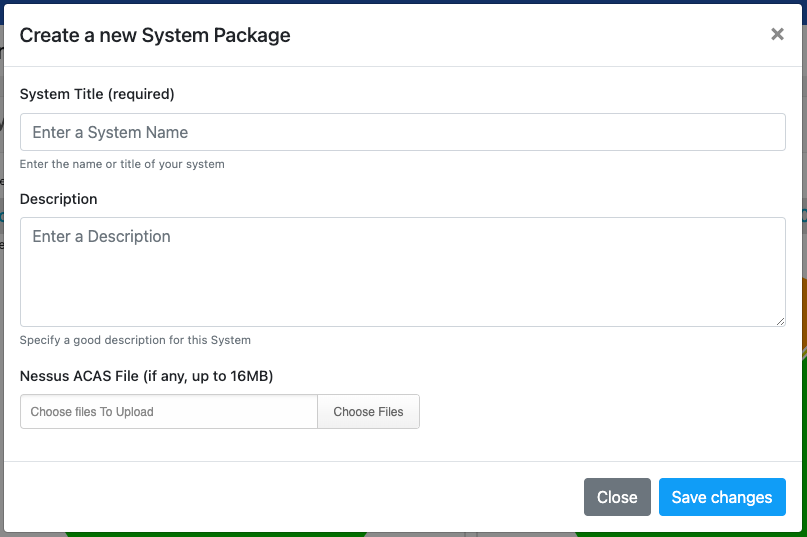
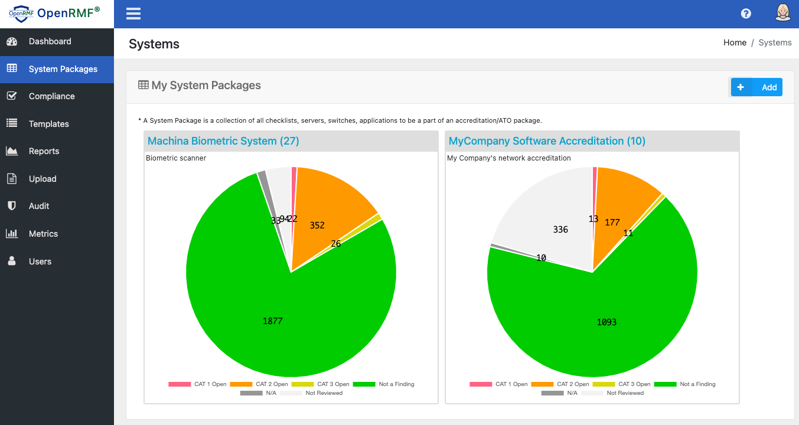

# Add a System Package

A system package is an ATO package, accreditation boundary, or network boundary. It is where you have a group of checklists and compliance scans along with patch vulnerability scans that you need to get an authority to operate (ATO) or an assessment done as a collection. 

To add a system package, you click the System Packages menu on the left. Then on the next page as an Admin role, you click the Add button. Specify your name, description and load a .nessus credentialed patch scan if you have one. Click the Save button and your new empty system package is ready for checklist and compliance scan uploads.

# Listing System Packages

The list of system packages shows when you click the System Packages menu. You will see the name, number of checklists, as well as a breakdown of the total checklist score based on vulnerabilities and their status.

