# Available Reports in OpenRMF&reg; OSS

Currently there are 10 interactive reports in OpenRMF&reg; OSS as pictured below. 

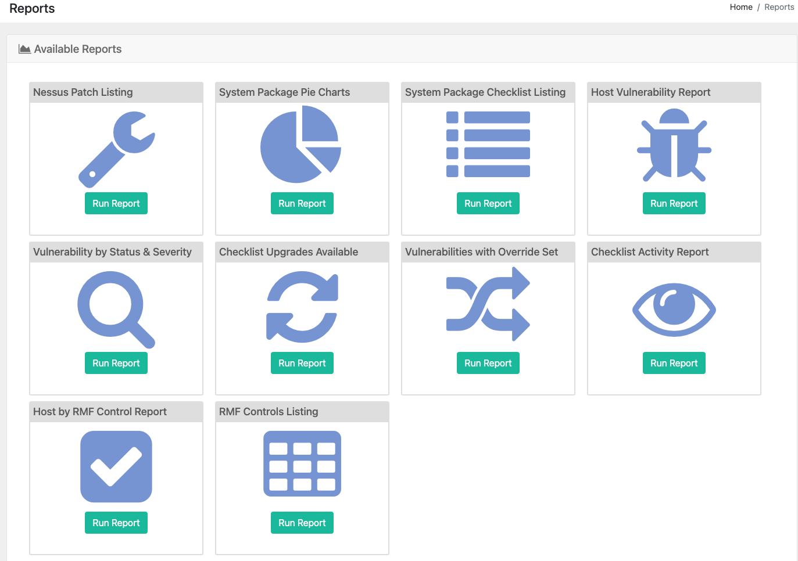

## Nessus Patch Listing Report
If you have a Nessus (`*.nessus`) / ACAS scan result file imported for your system package, this report will show all data in an interactive table. You can sort the columns, use the Search box to filter data, and click the + icon to see more/less of the detailed data per scan result item.

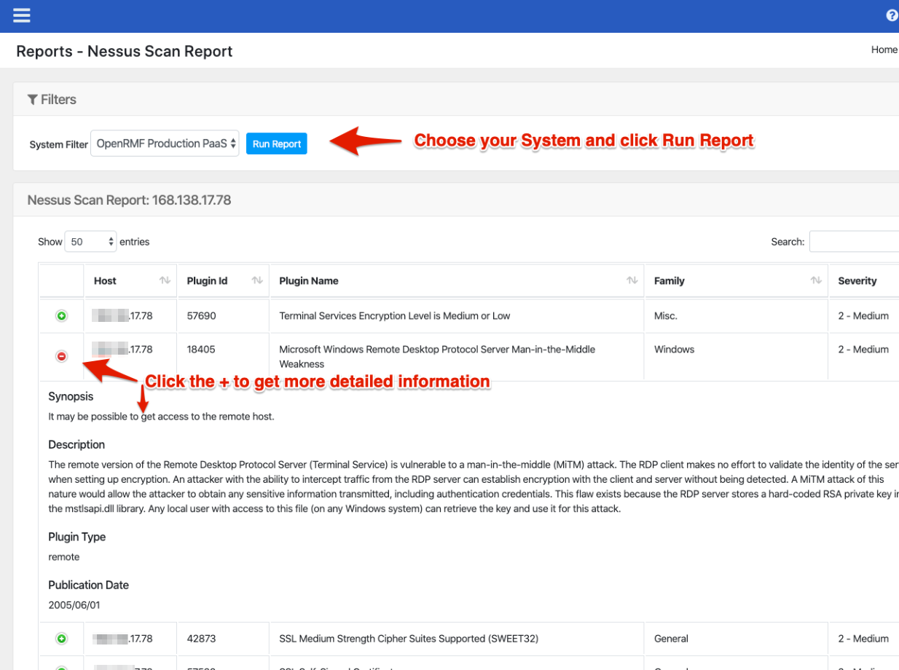

## System Score Chart
This is a larger chart used for exporting and viewing the total items in a system package by status. The Open items are also further separated by Category 1, 2, and 3 specifically.

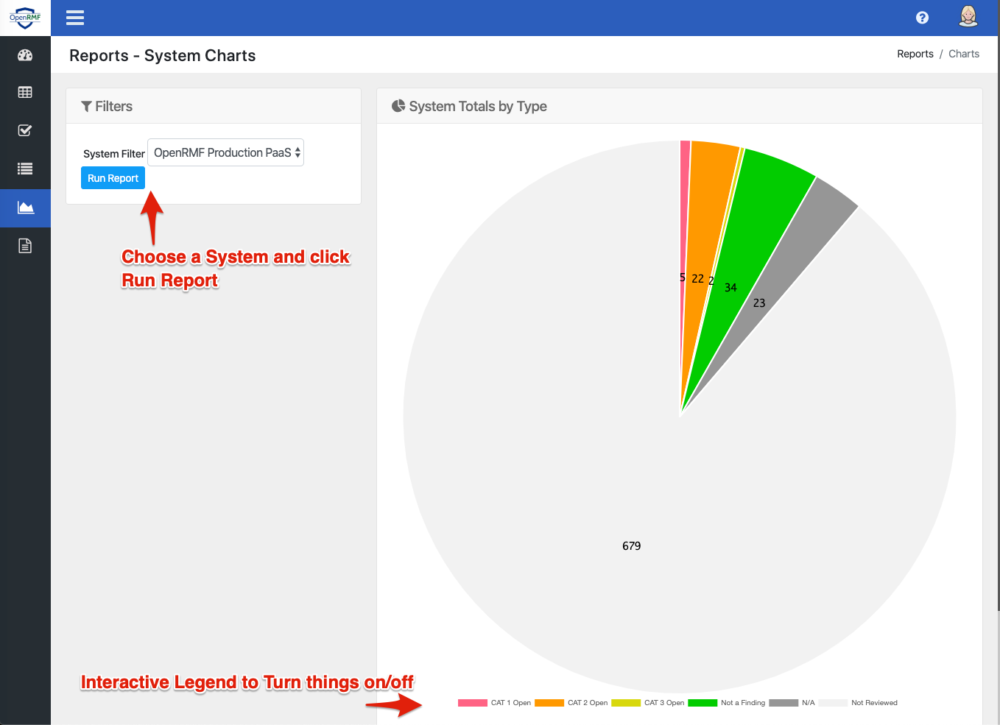

## System Checklist Vulnerability Report
This report allows you to select a system package to load all available checklists. Choose an checklist and click the Run Report button to see all vulnerability data in an interactive table format. You can order columns, use the Search box to filter the information, and click the + icon to see more detailed information on the vulnerability.

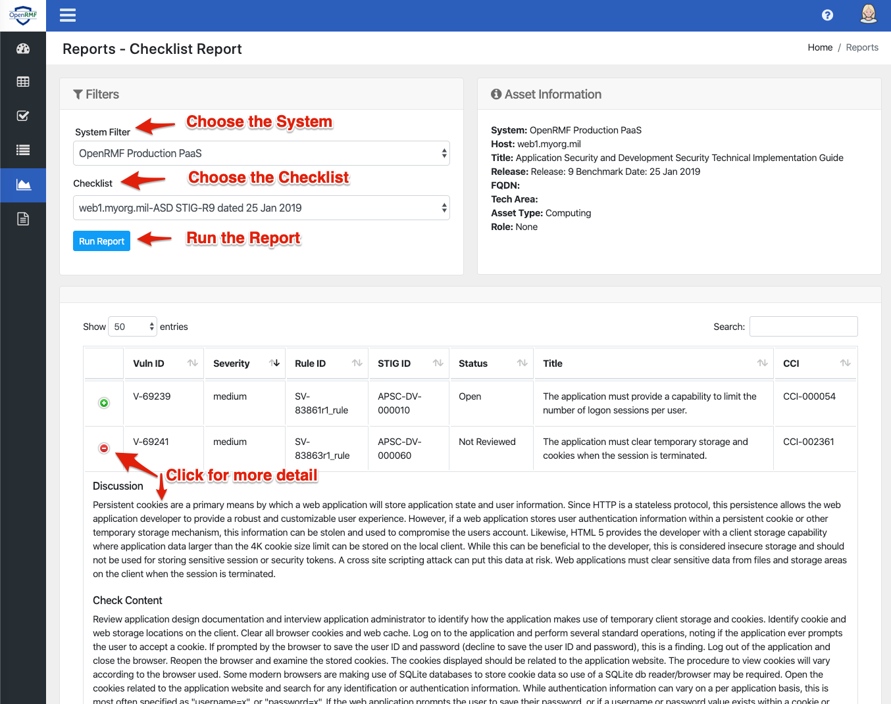

## Host Vulnerability Report
This report lets you search on a vulnerability and see what hosts and checklists have that vulnerability across all checklists within your system package.

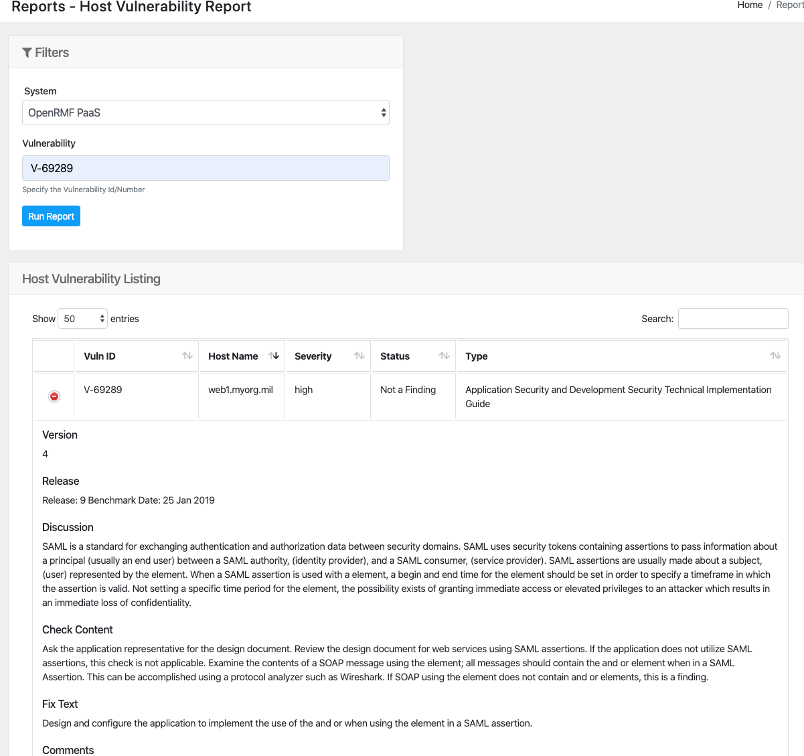

## Vulnerability by Status &amp; Severity Report
This report lets you choose your system package, then pick the statuses and severities of vulnerabilities you wish to view. Click the Run Report button to view the results. Click the green + sign to get more detail on the vulnerabilities.

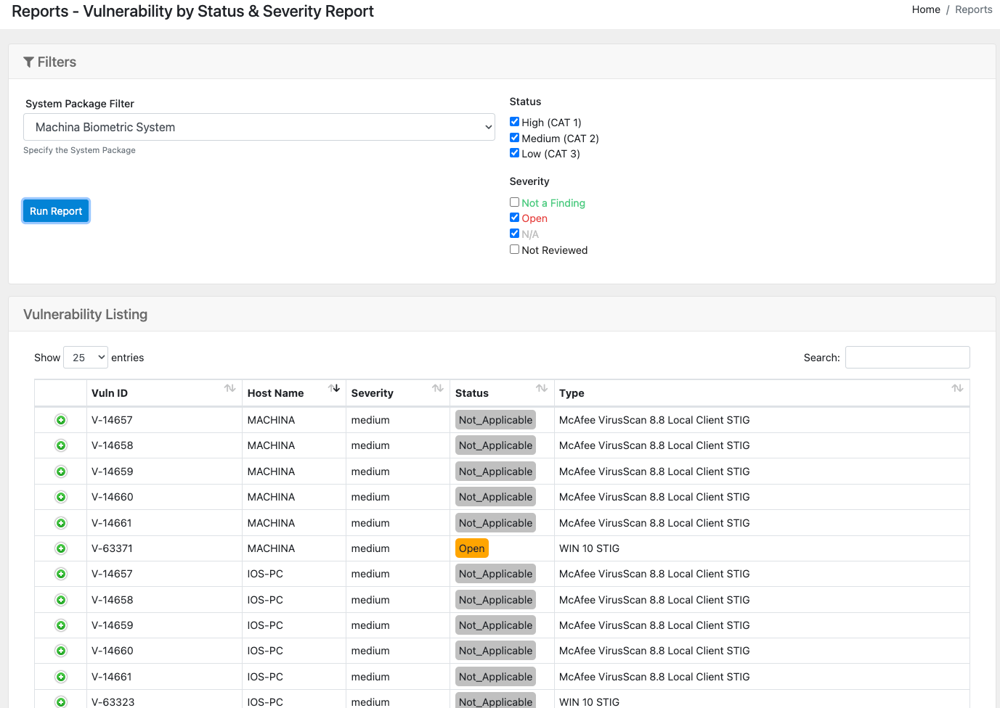

## Checklist Upgrades Available Report
This report lets you choose your system package, then goes one-by-one through the checklists and runs them against the Templates listing to see if there is an updated version or release of your checklist available. If so, it will display it. 

Click the checklist and go to the checklist record to upgrade your checklist accordingly. 

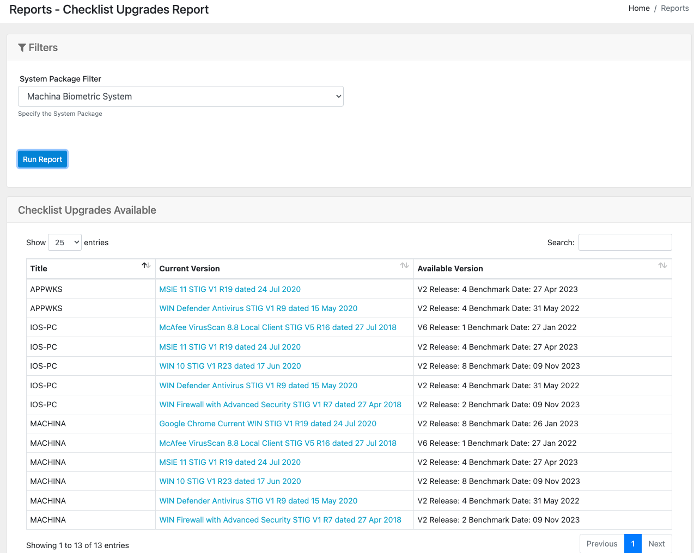

## Vulnerabilities with Override Status Set
This report lets you choose your system package, and then shows all vulnerabilities where the Severity Override has been set different than the actual severity (if any).

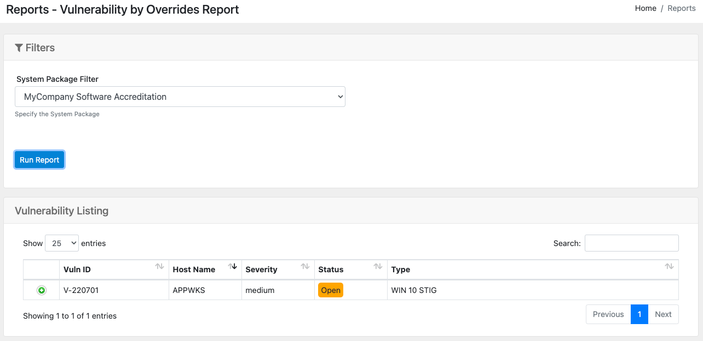

## Checklist Activity Report
This report lets you select a system package and then show the date of creation or last update to show how stale your data may be.

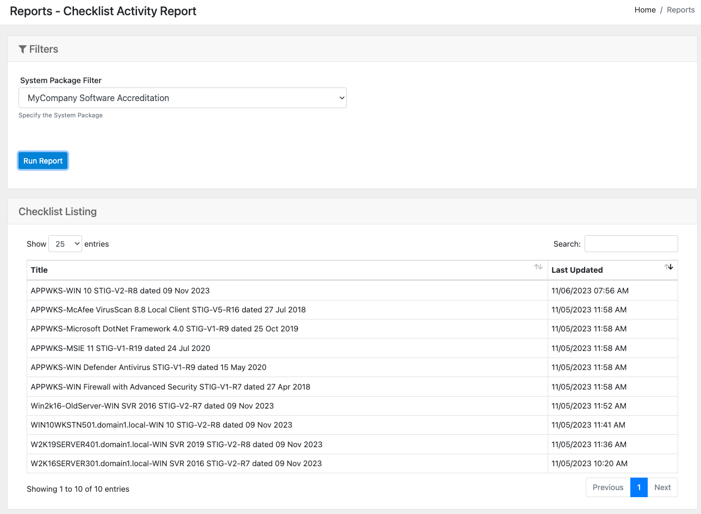

## Host by RMF Control Report
This report lets you search on a system package and major RMF control and see what servers, workstations, devices, etc. relate to that control across all your checklists.

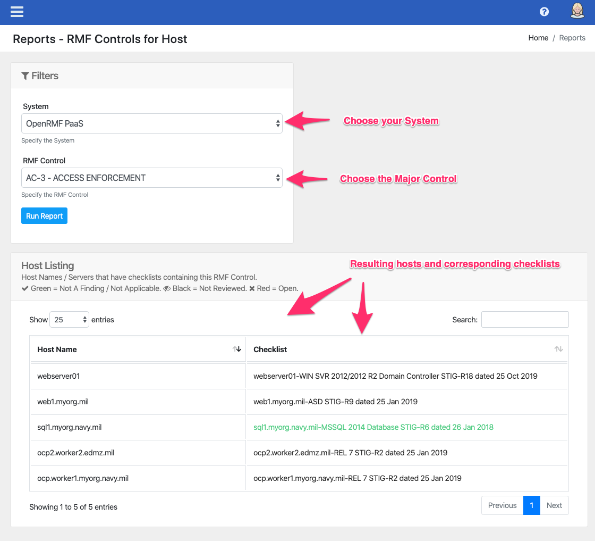

## RMF Controls Listing Report
This report lists out the controls and subcontrols across the RMF control listing to let you have more detailed information on what it represents. 

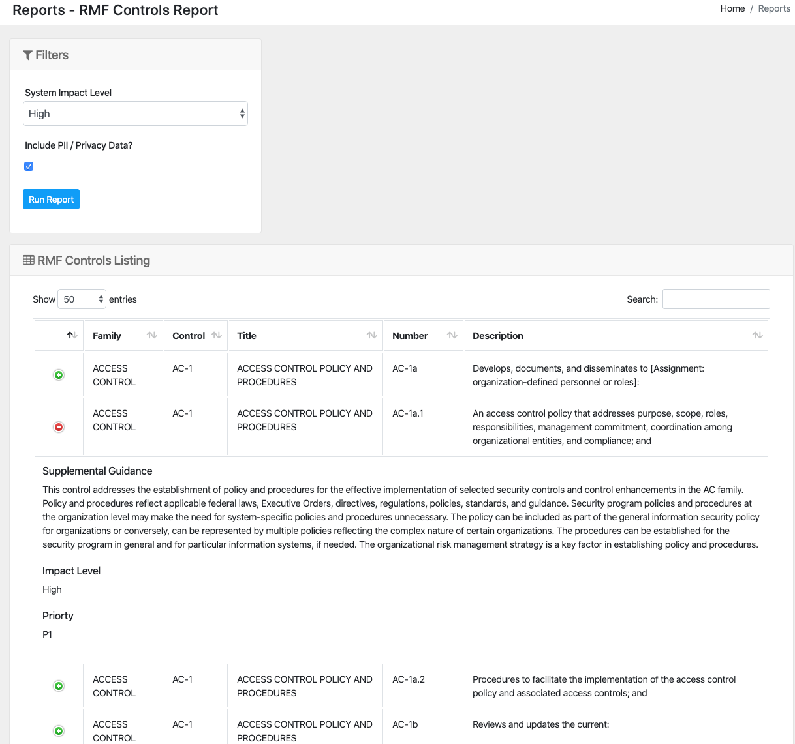

## A Note on Refreshing Data

The Nessus Patch Listing and Host Vulnerability Report use the Report API and Report Database to return results quickly. The data is already formatted in a way for very fast retrieval, especially across system packages with large numbers of checklists and Nessus Patch data. This data uses an "eventual consistency" pattern. When a new or updated checklist or scan is loaded into OpenRMF&reg; OSS, a separate process is kicked off behind the scenes so you can get back to the OpenRMF&reg; OSS interface. This process, as an example, pulls the Nessus ACAS Patch data report, parses the data, and puts separate records of the scan results into a particular MongoDB collection for later reporting. 

"Eventual" does not mean hours later! But it does mean you need to give it processing time. For scans of 4 or 5 machines we are talking a minute or two. For a large system package of 100 hosts being scanned, the time required would be more on the lines of 15 minutes or so to process all the data. This of course depends on the amount of data in the scan, the type of scans, the amount of processing power you give OpenRMF&reg; OSS and the amount of CPU and Memory in particular you give the Report Message client if you are running something like Kubernetes.

Right now only those 2 reports use the Report API and database with eventual consistency. There may be more in the future. To learn more about this design choice see https://martinfowler.com/articles/microservice-trade-offs.html.