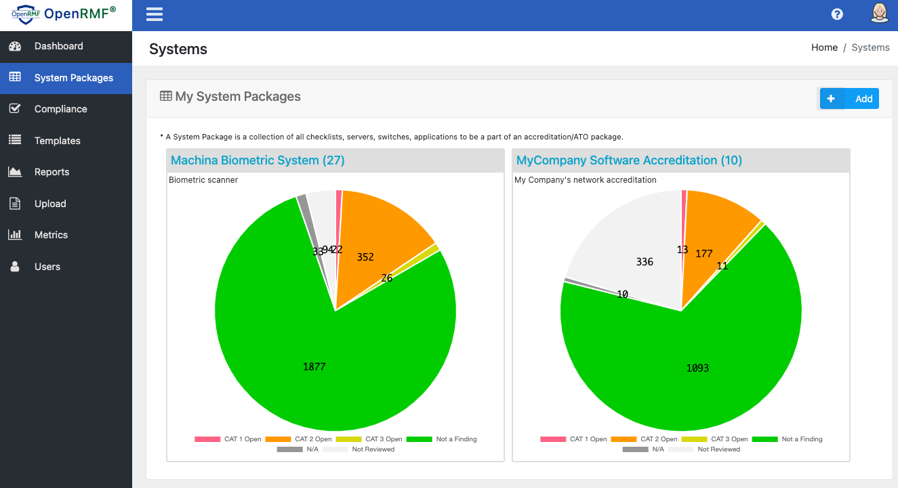
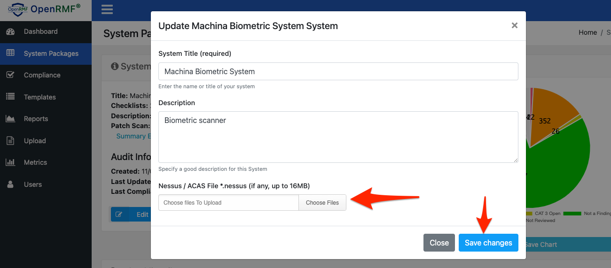

# Viewing your System Packages

The System Package listing is available when you log in and click on System Packages in the menu. The above screen loads if there are any checklists loaded. Each system is listed with the title linked to the detailed System Packages page with information and checklists listed.

> Note: if you have the Editor or Administrator permission you will also see an Add button here to add a new system. You also can add a new system by specifing a new system title when uploading a checklist or scan file.

Each listing shows the title, the number of checklists in that system as well as the overall score of the system.  This overall score is based on status across all checklists in your system.

## System Package Detailed View

The System Package detailed page shows relevant system information such as the title and description. It also allows you to edit specific information if you have the correct role. There is detailed audit information on the right such as the create date and last date updated. The compliance date is updated each time you run a compliance report on the system. 

New features include the ability to upload and view Nessus / ACAS scan file data as well as generate exports and reports from that `*.nessus` file. And you can generate a Test Plan Summary for your system showing all items that are open from your ACAS scan data, SCAP scans, and your manual CKL checklist files across your whole system.

At the bottom of this page is the list of all checklists for this system linked by title. Their overall score is also displayed in the filtered table. Click the plus sign to expand the score by category of vulnerability to get more detailed information.  Click on the actual checklist title to view the detailed information on that checklist.

## Uploading Nessus ACAS Scans

Once you have a System Package record, you can click the Edit button for the system to upload a *.nessus file for your scan output. OpenRMF&reg; OSS will save your file (a single file for the OSS version) and generate export listing for the whole system or by host into MS Excel files. You also can run reports on the Nessus file based on your system in the Reports area. 

The Dashboard will also show the total number of Critical, High, Medium, and Low items once your have uploaded a .nessus file as well. Remember, OpenRMF&reg; OSS stores a single file. So upload the most up-to-date file that has all your servers in the listing. 

More Information Here: https://docs.tenable.com/nessus/Content/PatchManagement.htm
