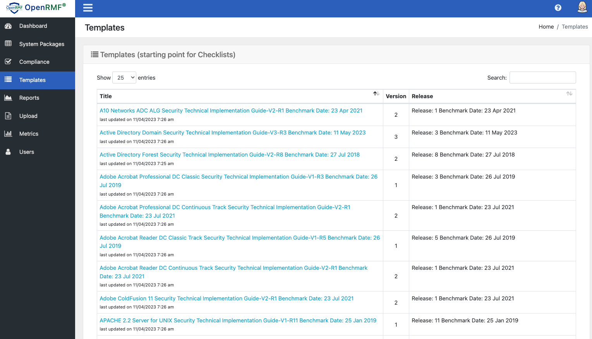

# Using Templates for your Checklists

There are 2 types of templates in OpenRMF&reg; OSS. The default DISA templates that are available from their https://public.cyber.mil/stigs/ public listing website. And then there are User Templates that you can upload as a starting point for checklists. User Templates can be from other CKL files you have updated to use as a boilerplate, a custom checklist you make in OpenRMF&reg; Professional, or from a default DISA one you have added some special text or details to. 

In the OpenRMF OSS we include the latest default public (i.e. non-PKI required) DISA checklists as templates in our template component. That way you have them for SCAP scans to associate reults into checklists. All default DISA templates have everthing as Not Reviewed so we do not calculate the score on the DISA default templates to speed up page loading. 

> Check the [What's New](./whatsnew.html) listing for the version and the latest DISA checklist templates we have included in that version.

User Templates are added via the Upload page in the Template Upload area. The User Template listing are user templates that those with permissions have added. The Template name as well as the score of items are shown simimlar to the Checklist listing page. Click the linked Template to view the detailed information. Click the green plus sign to view the scoring based on category. For User Templates, we calculate the score of the template for you based on vulnerabilities.

You can use DISA or User Templates in OpenRMF&reg; OSS for a starting point for your checklists. A great example would be you have an infrastructure package and a platform-as-a-service package that your application(s) run on. That infrastructure and PaaS have known good checklists as a baseline that application owners use as a starting point and adjust the remaining vulnerability items accordingly. 

On the Checklist Template page showing the individual checklist template, you can see the vulnerabilities. You also can click the Create Checklist button to make a new checklist based on the template in a system package you select. 

IT, Cyber, and other personnel would fill in checklists based on this checklist template when added as a checklist in your system package, and then fill out remaining items based on their software or system.