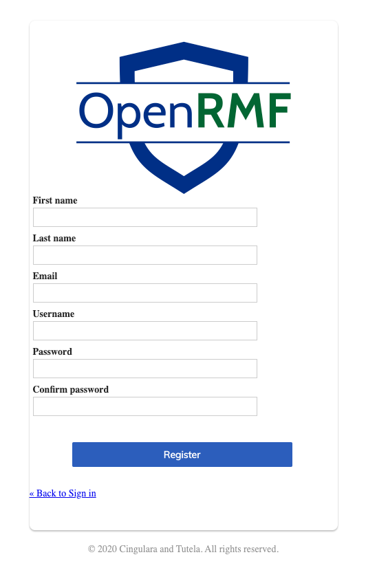
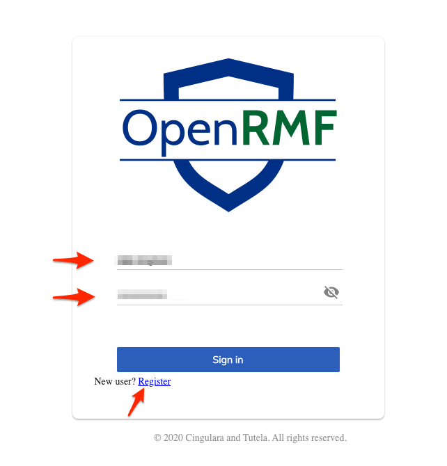
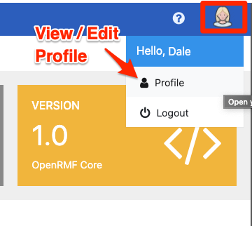
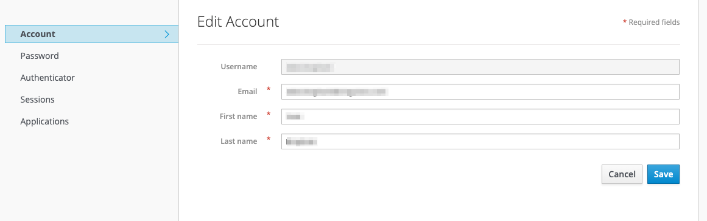
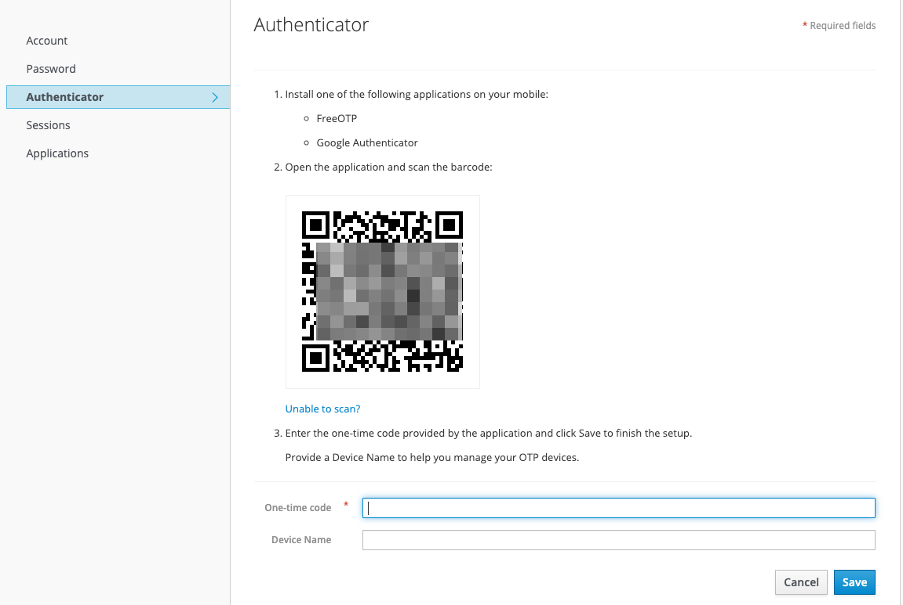

# Your OpenRMF&reg; OSS User Profile
Currently, OpenRMF&reg; OSS uses Keycloak for AuthN and Authz as well as role based access control (RBAC) for the application. You can view the [Run Latest Development](./latest.md) for information on setting up Keycloak. The specific user information for using Keycloak and OpenRMF&reg; OSS is below. 

## Register as a User

You can register as a new user with the registration form. You also can use the GitHub integration on the OpenRMF&reg; OSS Demo site to register as well. Enter the pertinent information including a valid email and you are automatically added as a Reader to the application. 

Once you have a registered account you can login with your user/password combination or the GitHub integration if on the Demo website. 

## User Profile

To access your User Profile from within OpenRMF&reg; OSS click the person icon in the very far right top of the application screens. Then click the Profile link. You are redirected to the Keycloak User Profile screen based on your session. From here you can see your account information and update your name and email. 

You also can change your password and see what sessions your account currently has active. 

To return to the OpenRMF&reg; OSS application you can click the "Back to OpenRMF&reg; OSS Login" in the top right of the screen. Or if you wish, click the Sign Out link to log out. 

## MultiFactor Authentication - Authenticator

For further security, you can setup multifactor authentication in your User Profile area of Keycloak. Log into OpenRMF&reg; OSS, go to your profile and then click the Authenticator menu on the left. Use Google Authenticator or FreeOTP to scan the barcode and follow the instructions on the screen to enable MFA. 